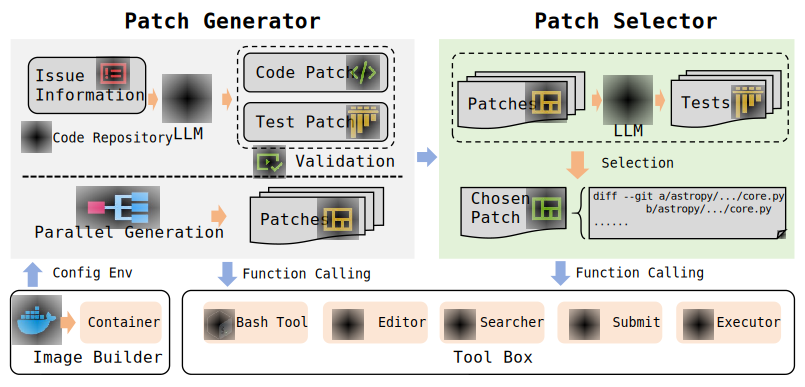

# InfCode

[](https://www.python.org/downloads/) [](https://opensource.org/licenses/MIT)


**InfCode** is an intelligent Code Agent System developed by [Tokfinity](https://www.tokfinity.com)'s Code Research team, which uses LLMs to automatically analyze and fix Code Repo issues. 

**Project Status:** InfCode has achieved **79.4%** solution rate on the SWE-Bench Verified split, demonstrating the **latest SOTA** performance.


## 🌟 System Architecture




### Core Modules

The InfCode adopts a generate-select architectural pattern. Its core modules include the **Patch Generator** and the **Patch Selector**, which are responsible for generating candidate patches and selecting the optimal patch, respectively.

- **Patch Generator**: Register multiple groups of generators, where each generator is configured with a separate container to generate and repair multiple candidate patches in parallel. Can interact with `File Editor`, `File Search`, `Bash Executor`, `Result Submitter` tools. The Patch Generator runs up to $5$ attempts and gathers all produced patches. 
- **Patch Selector**: Select the best patch from all the candidate patches. Can interact with `File Editor`, `File Search`, `Bash Executor` tools.


### Other Modules

In addition to the core modules, InfCode includes several other modules, such as the **Image Builder**, **Tool Executor**, and **LLM API Manager**, which handle image construction, tool execution, and API management, respectively. These modules complement the core modules and enhance the overall system functionality.

- **Image Builder**: This component is responsible for generating dedicated container images for each example in the benchmark suite. The images are stored locally and reused across iterative runs to improve efficiency.
- **Tool Executor**: This module is responsible for receiving tool-level instructions, executing the specified commands within the containerized environment, collecting the execution outputs, and transmitting the results back to the tool layer.
- **LLM API Manager**: Unified LLM API manager. It invokes the LLM API through the completion endpoint to retrieve model-generated responses. It supports integration with OpenAI, OpenRouter, and DeepSeek clients, as well as self-hosted (privately deployed) LLM instances. 


## ✨ Tools Support

To enable interaction with code repositories, the InfCode is equipped with the following tools:

- **File Editor**:
    - File Preview (view): Retrieve the content of a specified line range from a file within the container.
    - File Creation (create): Create a new file within the container and populate it with the specified content.
    - File Modification (str_replace): Modify specific portions of a given file within the container by replacing designated content.
    - File Insertion (insert): Insert specified content into a designated position within a target file in the container.

- **File Searcher**:
    - The LLM outputs a search pattern, which the tool uses to perform file searches within the container.
    - The tool then parses and returns the results from the container.

    > This module is implemented based on `ripgrep`, a high-performance file search utility that outperforms traditional `grep` in speed and supports fuzzy matching for enhanced search flexibility.


- **Bash Executor**:
    - Execute Bash commands generated by the LLM within the container environment.
    - Parse and return the execution results from the container.


- **Result Submitter**:
    - After the LLM completes patch generation and testing, it triggers this tool and provides patch generation details.
    - The tool executes `git diff` within the container to obtain and return the patch content.


## 📖 Quick Start

### 1. Environment Setup

- Create a `.env` file in the project root directory and configure the necessary environment variables:

```bash
# LLM API configuration
OPENROUTER_API_KEY=your_openrouter_api_key
```


- Install the pip dependencies, Python 3.12 is recommended.
```bash
pip install -r requirements.txt
```


### 2. Run the System

#### Batch Execution

```bash
python _batch_run.py -c config/batch.yaml --name first -i config/list_all.txt -p 2 --clean
```

Explanation:

- `-c` specifies the batch configuration file (currently minimal)
- `-name` assigns a name to this batch run
- `-i` specifies the issue list file
- `-p` sets concurrency (default 20)
- `-clean` clears the output directory before running (useful when reusing the same name)
- `-o` sets the output directory (default: ./batch_out/)
- `-h` prints help


#### Evaluation

```bash
./eval.sh <run_id>
```

Explanation:

- `run_id` — required parameter identifying this evaluation run
- The script automatically reads dataset and prediction paths from `config/config.yaml`.
Since batch_run results are redirected, you may need to manually copy the preds.json file to the path specified in the config.
- Uses the official SWE-bench evaluation tool to verify generated patches
- Supports multi-process parallel evaluation (default: 20 workers)
- Results will be saved in the specified directory, including pass rates, failure reasons, and detailed logs


### 3. Configuration Files

The main configurations are in `config/config.yaml`:
- `providers`: LLM provider settings
- `runner`: runner settings (concurrency, number of iterations, etc.)
- `builder`: Docker image build settings
- `log`: logging settings


### Notes

- Ensure Docker is installed and running correctly.
- Check logs for detailed execution steps.
- Supports multiple LLM providers, tool formats are auto-selected based on configuration.
- We also provide an automated failure analysis tool based on result trace files to help you quickly identify the root cause of bad cases.[here](https://github.com/Tokfinity/InfCode/blob/main/analyzer/README.md).


## Contact

research@tokfinity.com


## Core Team

- [Pete Wong](https://petewongggg.github.io/)

- [Kirito](https://github.com/kirito41dd)

- [Hengzhi Zhang](https://henryzhang11.github.io)

- [Kefan Li](https://lbaf23.github.io)

- [Qingao Dong](https://qadong.github.io)


## 📄 License

This project is licensed under the MIT License - see the [LICENSE](LICENSE) file for details.

## 🙏 Acknowledgments
We thank Anthropic for building the [anthropic-quickstart](https://github.com/anthropics/claude-quickstarts) project and bytedance for building the [trae-agent](https://github.com/bytedance/trae-agent) project that served as valuable references for the tool building.


